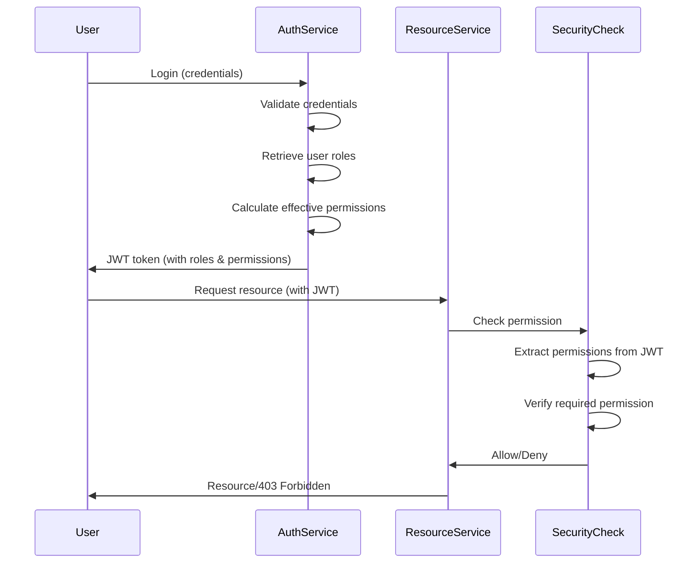

# Role-Based Access Control (RBAC) in EAF

This document provides a comprehensive guide to the RBAC system implemented within the ACCI EAF platform.

## 1. Introduction

The RBAC system in EAF provides a flexible and secure access control mechanism that allows granular control over user and service account permissions. The system supports both global (system-wide) and tenant-specific roles, enabling effective multi-tenant isolation while maintaining centralized administration.

## 2. RBAC Architecture

### 2.1 Core Entities

The RBAC system is built around three main entities:

1. **Permission**: The smallest unit of access control, representing a specific action on a resource.
2. **Role**: A collection of permissions that can be assigned to users or service accounts.
3. **User/Service Account**: The actors who are assigned roles and inherit their permissions.

### 2.2 Entity Relationships

The relationships between these entities are structured as follows:

```
           ┌─────────────┐       ┌─────────────┐       ┌─────────────┐
           │             │       │             │       │             │
           │    User     │ M───N │    Role     │ M───N │ Permission  │
           │             │       │             │       │             │
           └─────────────┘       └─────────────┘       └─────────────┘
                                       │
                                       │
                                       │
                                 ┌─────┴─────┐
                                 │           │
                                 │  Tenant   │
                                 │           │
                                 └───────────┘
```

#### Key Relationships

1. **Role-Permission**: Many-to-many relationship. A role can have multiple permissions, and a permission can belong to multiple roles.
2. **User-Role**: Many-to-many relationship. A user can have multiple roles, and a role can be assigned to multiple users.
3. **Role-Tenant**: Many-to-one relationship. A role can belong to a specific tenant (tenant-specific role) or no tenant (global role).

### 2.3 RBAC Flow

The authorization flow works as follows:

1. User authenticates and receives a JWT containing their roles and effective permissions
2. When the user attempts to access a protected resource, their permissions are checked
3. Access is granted only if the user has the required permission(s)



## 3. Permission Model

### 3.1 Permission Structure

Permissions follow a consistent naming convention:

```
resource:action
```

Where:

- `resource` is a noun representing the domain entity (e.g., user, role, tenant)
- `action` is a verb representing the operation (e.g., create, read, update, delete)

Examples:

- `user:create` - Permission to create users
- `role:assign` - Permission to assign roles to users
- `tenant:read` - Permission to view tenant information

### 3.2 System Permissions

The following permission categories are defined in the system:

#### User Management

- `user:create` - Create users
- `user:read` - View user information
- `user:update` - Update user details
- `user:delete` - Delete users

#### Role Management

- `role:create` - Create roles
- `role:read` - View role information
- `role:update` - Update role details
- `role:delete` - Delete roles
- `role:assign` - Assign roles to users

#### Permission Management

- `permission:read` - View permissions

#### Tenant Management

- `tenant:create` - Create tenants
- `tenant:read` - View tenant information
- `tenant:update` - Update tenant details
- `tenant:delete` - Delete tenants

### 3.3 Permission Inheritance

Permissions are not hierarchical and do not inherit from each other. Instead, roles serve as the mechanism for grouping permissions.

## 4. Role Model

### 4.1 Role Types

The system supports two types of roles:

1. **Global Roles**: Not associated with any tenant, managed by EAF super-administrators
   - Example: `SystemAdministrator`, `AuditViewer`

2. **Tenant-specific Roles**: Associated with a specific tenant, managed by tenant administrators
   - Example: `TenantAdmin`, `ContentEditor`, `ReadOnlyUser`

### 4.2 Built-in Roles

The system includes several built-in roles to facilitate management:

| Role Name | Type | Description | Key Permissions |
|-----------|------|-------------|----------------|
| SystemAdministrator | Global | Full system access | All permissions |
| TenantAdministrator | Tenant | Manages a single tenant | `user:*`, `role:*` (within tenant) |
| ReadOnlyUser | Tenant | Read-only access | `*:read` (within tenant) |

### 4.3 Custom Roles

Administrators can create custom roles to meet specific business requirements:

- **Global Custom Roles**: Created by EAF super-administrators
- **Tenant Custom Roles**: Created by tenant administrators within their tenant

## 5. RBAC Implementation

### 5.1 Database Schema

The RBAC system uses the following database tables:

1. **roles**:
   - `role_id` (Primary Key, UUID)
   - `name` (String, unique per tenant)
   - `description` (String, nullable)
   - `tenant_id` (UUID, nullable - null for global roles)

2. **permissions**:
   - `permission_id` (Primary Key, UUID)
   - `name` (String, unique)
   - `description` (String, nullable)

3. **role_permissions** (Join table):
   - `role_id` (Foreign Key to roles)
   - `permission_id` (Foreign Key to permissions)
   - Combined Primary Key (role_id, permission_id)

4. **user_roles** (Join table):
   - `user_id` (Foreign Key to users)
   - `role_id` (Foreign Key to roles)
   - `tenant_id` (UUID)
   - Combined Primary Key (user_id, role_id)

### 5.2 API Endpoints

The RBAC system exposes the following API endpoints:

#### Permission Management

- `GET /api/controlplane/permissions` - List all permissions
- `GET /api/controlplane/permissions/{permissionId}` - Get permission details
- `GET /api/controlplane/permissions/search?namePart={searchTerm}` - Search permissions by name

#### Global Role Management

- `GET /api/controlplane/roles` - List all global roles
- `POST /api/controlplane/roles` - Create a global role
- `GET /api/controlplane/roles/{roleId}` - Get global role details
- `PUT /api/controlplane/roles/{roleId}` - Update a global role
- `DELETE /api/controlplane/roles/{roleId}` - Delete a global role
- `POST /api/controlplane/roles/{roleId}/permissions/{permissionId}` - Add permission to role
- `DELETE /api/controlplane/roles/{roleId}/permissions/{permissionId}` - Remove permission from role
- `GET /api/controlplane/roles/{roleId}/permissions` - List permissions for a role

#### Tenant Role Management

- `GET /api/controlplane/tenants/{tenantId}/roles` - List roles for a tenant
- `GET /api/controlplane/tenants/{tenantId}/roles/available` - List available roles for a tenant
- `POST /api/controlplane/tenants/{tenantId}/roles` - Create a tenant-specific role
- `GET /api/controlplane/tenants/{tenantId}/roles/{roleId}` - Get tenant role details
- `PUT /api/controlplane/tenants/{tenantId}/roles/{roleId}` - Update a tenant role
- `DELETE /api/controlplane/tenants/{tenantId}/roles/{roleId}` - Delete a tenant role
- `POST /api/controlplane/tenants/{tenantId}/roles/{roleId}/permissions/{permissionId}` - Add permission to tenant role
- `DELETE /api/controlplane/tenants/{tenantId}/roles/{roleId}/permissions/{permissionId}` - Remove permission from tenant role

#### User Role Management

- `GET /api/controlplane/tenants/{tenantId}/users/{userId}/roles` - List roles for a user
- `POST /api/controlplane/tenants/{tenantId}/users/{userId}/roles/{roleId}` - Assign role to user
- `DELETE /api/controlplane/tenants/{tenantId}/users/{userId}/roles/{roleId}` - Revoke role from user

### 5.3 Service Layer

The RBAC system is implemented through the following services:

1. **PermissionService**: Manages permission entities
2. **RoleService**: Manages role entities and role-permission relationships
3. **UserRoleService**: Manages user-role assignments

### 5.4 Security Integration

The RBAC system integrates with Spring Security using:

1. **JWT Claims**: User permissions are included in the JWT token
2. **Method Security**: `@PreAuthorize` annotations enforce permission checks
3. **Custom Expressions**: `isMemberOfTenant(tenantId)` for tenant isolation

Example security annotation:

```kotlin
@PreAuthorize("hasAuthority('role:assign') and isMemberOfTenant(#tenantId)")
fun assignRoleToUser(tenantId: UUID, userId: UUID, roleId: UUID) {
    // Method implementation
}
```

## 6. Using RBAC in EAF Applications

### 6.1 Protecting Endpoints

To secure REST endpoints, use the `@PreAuthorize` annotation with permission checks:

```kotlin
@RestController
@RequestMapping("/api/resources")
class ResourceController(private val resourceService: ResourceService) {
    
    @GetMapping
    @PreAuthorize("hasAuthority('resource:read')")
    fun getResources(): List<ResourceDto> {
        return resourceService.getAllResources()
    }
    
    @PostMapping
    @PreAuthorize("hasAuthority('resource:create')")
    fun createResource(@RequestBody resourceDto: ResourceDto): ResourceDto {
        return resourceService.createResource(resourceDto)
    }
}
```

### 6.2 Protecting Service Methods

Service methods can also be secured with `@PreAuthorize`:

```kotlin
@Service
class ResourceServiceImpl(private val resourceRepository: ResourceRepository) : ResourceService {
    
    @PreAuthorize("hasAuthority('resource:read') and isMemberOfTenant(#tenantId)")
    override fun getResourcesForTenant(tenantId: UUID): List<Resource> {
        return resourceRepository.findByTenantId(tenantId)
    }
}
```

### 6.3 Programmatic Security Checks

For complex authorization logic, use the `SecurityUtils` class:

```kotlin
@Service
class ComplexService(private val securityUtils: SecurityUtils) {
    
    fun performComplexOperation(tenantId: UUID, resourceId: UUID) {
        // Check permissions programmatically
        if (!securityUtils.hasPermission("resource:update") || 
            !securityUtils.isMemberOfTenant(tenantId)) {
            throw AccessDeniedException("Insufficient permissions")
        }
        
        // Proceed with operation
    }
}
```

## 7. Audit and Monitoring

### 7.1 Audit Logging

All RBAC administrative actions are logged in the audit system:

- Role creation/modification/deletion
- Permission assignments to roles
- Role assignments to users

### 7.2 Security Monitoring

Security events related to RBAC include:

- Failed permission checks
- Attempts to access unauthorized resources
- Changes to role/permission configurations

## 8. Best Practices

### 8.1 Role Design

- Create roles based on job functions, not individuals
- Follow the principle of least privilege
- Avoid creating too many fine-grained roles (role explosion)
- Document the purpose and scope of each role

### 8.2 Permission Assignment

- Assign only the permissions needed for the role
- Regularly review and audit permission assignments
- Consider the security implications of powerful permissions

### 8.3 User-Role Assignment

- Assign users to the minimum number of roles needed
- Consider time-bound role assignments for temporary access
- Regularly audit user-role assignments

## 9. Extending the RBAC System

### 9.1 Adding New Permissions

When extending the system with new functionality:

1. Define appropriate permissions following the `resource:action` pattern
2. Register the permissions in the database
3. Update documentation

### 9.2 Supporting ABAC

The RBAC system is designed to be extensible toward Attribute-Based Access Control (ABAC) by:

1. Adding context-aware permission evaluators
2. Supporting conditional role assignments
3. Implementing time-bound permissions
